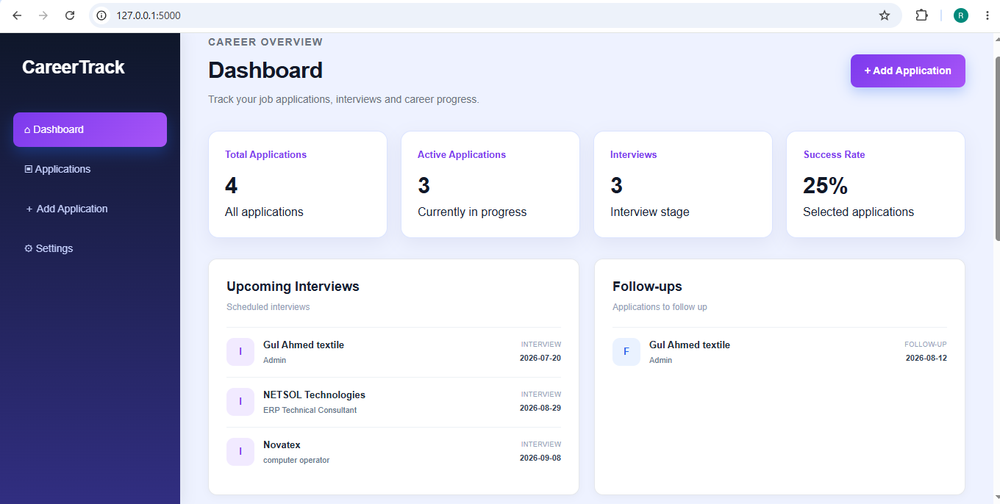
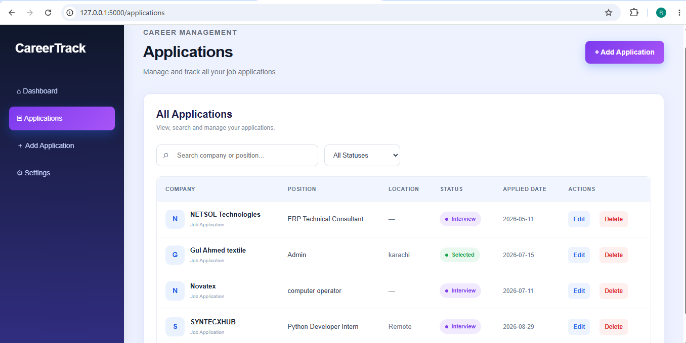
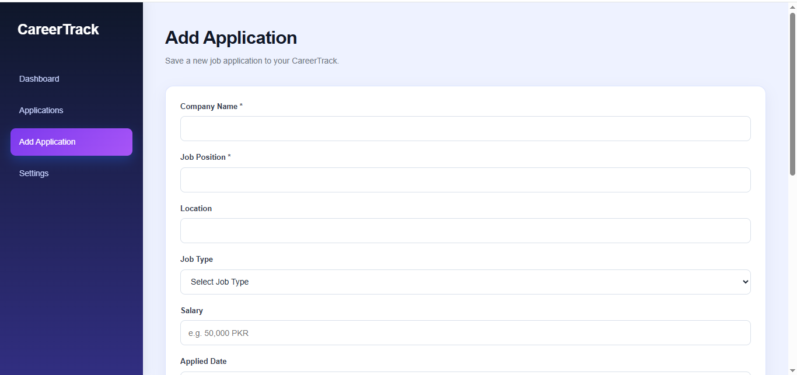
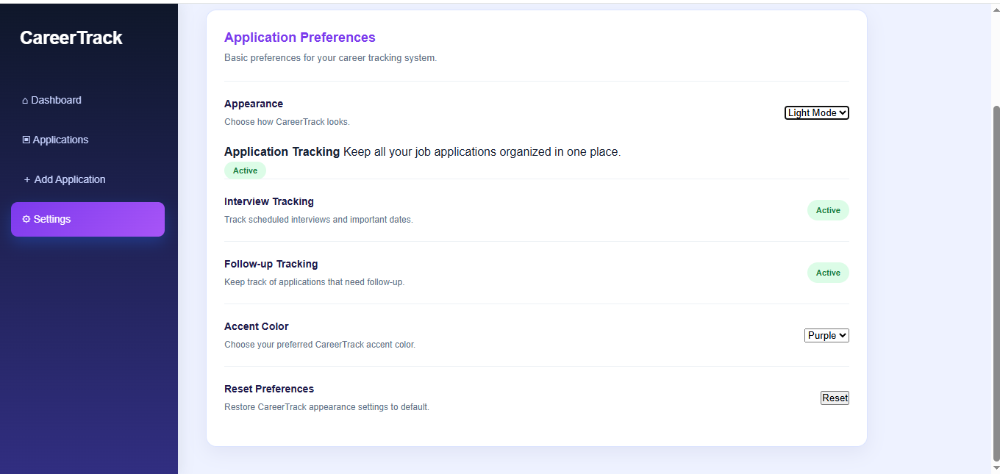

# CareerTrack

> **A simple and modern Job Application Tracking System built with Flask, Python, HTML, CSS and JavaScript.**

CareerTrack helps job seekers organize their job applications and keep track of application statuses, interviews, follow-ups, and overall job-search progress from one dashboard.

---

## 📌 Overview

Managing multiple job applications can become difficult when application details, interview dates, and follow-ups are spread across different places.

**CareerTrack** provides a centralized dashboard where users can:

* Record job applications
* Monitor application status
* Search and filter applications
* Manage interviews
* Track follow-ups
* Edit or delete application records
* Customize the application's appearance

The project was developed as a practical web development project to demonstrate backend, frontend, database, and user-interface development skills.

---

## ✨ Key Features

### 📊 Dashboard

* Total applications
* Active applications
* Interview count
* Success rate
* Upcoming interviews
* Follow-up applications
* Application status overview

### 💼 Application Management

* Add new applications
* View all applications
* Edit application details
* Delete applications
* Track company and job position
* Store location and application date
* Track application status

### 🔎 Search & Filter

* Search by company name
* Search by job position
* Filter applications by status
* Quickly find specific applications

### 📅 Interview & Follow-up Tracking

* Track scheduled interviews
* View upcoming interviews
* Track applications requiring follow-up
* Keep important application dates organized

### ⚙️ Settings & Customization

* Light Mode
* Dark Mode
* Blue, Purple and Green accent themes
* Application tracking preferences
* Interview tracking
* Follow-up tracking
* Reset appearance preferences

---

## 🛠️ Tech Stack

| Technology       | Purpose                            |
| ---------------- | ---------------------------------- |
| **Python**       | Backend programming                |
| **Flask**        | Web application framework          |
| **HTML**         | Page structure                     |
| **CSS**          | Styling and responsive UI          |
| **JavaScript**   | Interactive features               |
| **SQLite**       | Application data storage           |
| **Jinja2**       | Dynamic HTML templates             |
| **LocalStorage** | Saving user appearance preferences |

---

## 📂 Project Structure

```text
CareerTrack/
│
├── app.py
│
├── static/
│   ├── script.js
│   └── style.css
│
├── templates/
│   ├── index.html
│   ├── applications.html
│   ├── add_application.html
│   ├── edit_application.html
│   ├── settings.html
│   └── upcoming.html
│
├── README.md
└── careertrack.db
```

---

## 🚀 Getting Started

### Prerequisites

Make sure you have **Python** installed on your system.

### 1. Clone the Repository

```bash
git clone https://github.com/romankhan1449-creator/CareerTrack.git
```

### 2. Open the Project

```bash
cd CareerTrack
```

### 3. Create a Virtual Environment

```bash
python -m venv venv
```

### 4. Activate the Virtual Environment

**Windows:**

```bash
venv\Scripts\activate
```

### 5. Install Flask

```bash
pip install flask
```

### 6. Run the Application

```bash
python app.py
```

### 7. Open CareerTrack

Open the local address displayed by Flask in your browser.

Usually:

```text
http://127.0.0.1:5000
```

---
## 📸 Screenshots

### Dashboard


### Applications


### Add Application


### Settings


## 🖥️ Application Pages

| Page                 | Description                                     |
| -------------------- | ----------------------------------------------- |
| **Dashboard**        | View overall job-search activity and statistics |
| **Applications**     | View, search and filter all applications        |
| **Add Application**  | Add a new job application                       |
| **Edit Application** | Update existing application information         |
| **Upcoming**         | View upcoming interviews and follow-ups         |
| **Settings**         | Customize appearance and preferences            |

---

## 💾 Data Management

CareerTrack uses **SQLite** to store application information.

Application records can contain information such as:

* Company name
* Job position
* Location
* Application status
* Applied date
* Interview information
* Follow-up information

Appearance preferences such as theme and accent color are stored using browser **LocalStorage**.

---

## 🎯 Project Goals

The project was created to demonstrate practical experience with:

* Python web development
* Flask routing
* HTML templates
* CSS-based UI design
* JavaScript DOM manipulation
* SQLite database management
* Search and filtering functionality
* LocalStorage
* Git and GitHub

---

## 🔮 Future Improvements

Possible future versions could include:

* User authentication
* Multiple user accounts
* Cloud database integration
* Email reminders for interviews
* Follow-up notifications
* Resume management
* Job-board integration
* Application analytics and charts
* CSV/PDF export
* Online deployment

---

## 👨‍💻 Author

**Roman Khan**

Computer Engineering Technology Student

### Technologies & Skills

`Python` · `Flask` · `HTML` · `CSS` · `JavaScript` · `SQLite` · `Git` · `GitHub`

---

## 📄 License

This project was developed for educational and portfolio purposes.
